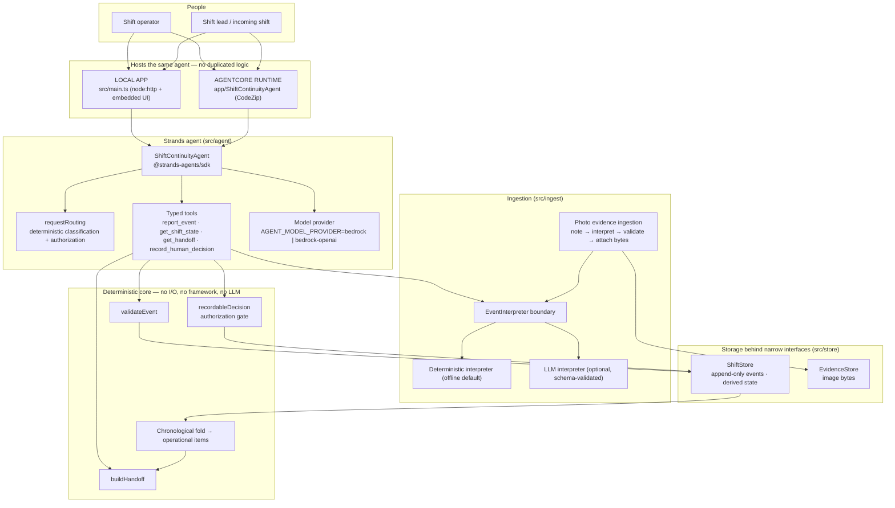
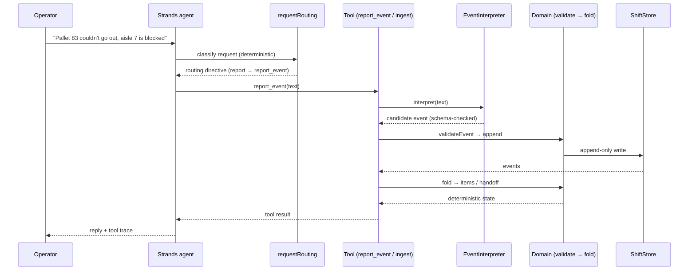

# Architecture

The product claim is narrow and deliberately split in two: **the model operates the
product, the domain decides what is true.** Everything below exists to keep that line
inspectable.



## Why the boundaries are where they are

- **`src/domain/`** imports only the standard library and other domain modules. It has
  no I/O, no web framework, no database, no AWS, and no LLM. The state machine — fold,
  conflict detection, resolution, human-decision reconciliation, handoff projection — is
  plain TypeScript and directly testable.
- **Events are the source of truth.** Nothing writes current state. `ShiftStore` accepts
  append-only events; current state is always re-derived by folding them in `occurredAt`
  order. History is never truncated, so a resolved event never disappears.
- **The LLM is an interpreter, never a state authority.** Its only job is
  `natural language → candidate structured event`. Identity fields (id, shiftId,
  occurredAt) are structurally forbidden in its output, everything it returns is
  schema-validated locally, and a provider failure yields a controlled error with zero
  state change. The deterministically-interpreted baseline is the default so the whole
  system works with no model configured.
- **The model chooses tools; tools own mutation.** Each tool wraps an existing
  application service (`ingestNaturalLanguageReport`, `getShiftState`, `buildHandoff`,
  `recordableDecision`). The agent therefore cannot invent current state — if it wants to
  know something, it has to ask the deterministic engine.
- **Authorization is model-independent.** Explicit human-decision phrasings are detected
  deterministically from the current request (`src/agent/requestRouting.ts`) and populate
  `invocationState` before the model runs. The `record_human_decision` tool re-checks
  that authorization itself, so a model that tries to decide a conflict on its own is
  refused. There is no path where the LLM fabricates human authority.
- **Storage is behind narrow interfaces.** `ShiftStore` has three implementations: JSON
  file (local app), in-memory (per-session, ephemeral), and DynamoDB (durable, deployed
  AgentCore runtime). The domain only ever sees the synchronous interface, so it cannot
  depend on DynamoDB — or know it exists. Selection is explicit via `SHIFT_STORE`
  (`src/store/shiftStoreFactory.ts`). `EvidenceStore` owns photo bytes. Neither interface
  leaks storage details into the domain.
- **Durability stores events, never folded state.** The DynamoDB table holds one item per
  operational event (`PK = SHIFT#<id>`, `SK = EVENT#<occurredAt>#<eventId>`) plus a shift
  metadata item. Because the domain is synchronous and pure, the runtime hydrates a
  snapshot, runs the same `foldState`/tool code, and flushes appended events with
  conditional writes; a cold start simply re-reads and re-folds. There is no second
  version of the truth.
- **Photo evidence never bypasses validation.** An attached image is metadata on the
  event; the note beside it is interpreted by the exact same pipeline as a typed report.
  Bytes are written only after interpretation and validation succeed, and are removed
  again if the append fails, so a rejected photo report leaves nothing behind.
- **One agent, two hosts.** AgentCore Runtime hosts the same `ShiftContinuityAgent`,
  the same tools, the same domain fold, and the same decision gate. The deployment
  entrypoint is a thin adapter: parse the request, resolve the per-session store, invoke
  the agent, return the envelope with the tool trace.

## Data flow for one report



Conflict case, deliberately failing safe:

```mermaid
sequenceDiagram
  participant U as Operator
  participant A as Strands agent
  participant G as record_human_decision (gate)
  participant S as ShiftStore

  U->>A: "Pick whichever makes sense for D104"
  A-->>U: no decision tool available (no authorization); surfaces conflict
  Note over A,G: agent cannot fabricate human authority
  A->>G: (if it tried) subject+claim with no invocationState authorization
  G-->>A: refused — nothing appended
  U->>A: "Send D104 to claims"
  Note over A: deterministic routing sets authorization for subject+claim
  A->>G: record_human_decision(D104, claims)
  G->>S: append decision_recorded (validated against folded state)
  S-->>A: item decided
  A-->>U: D104 decided; handoff no longer lists it for review
```
